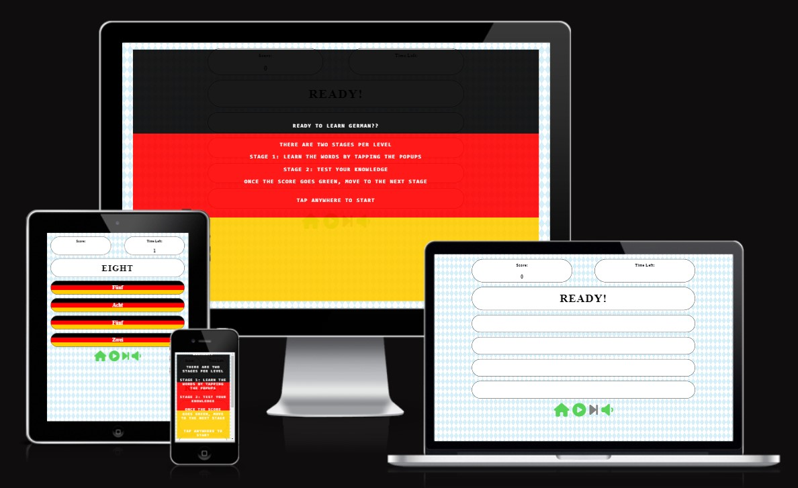
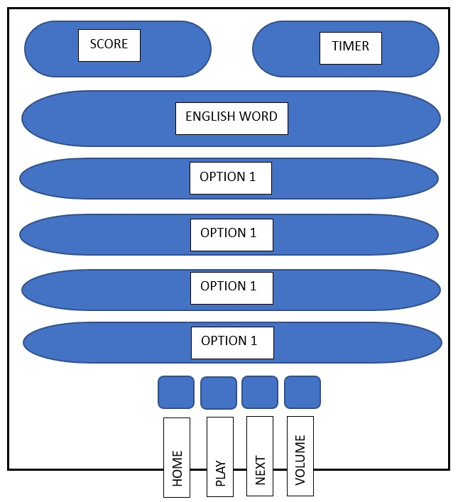
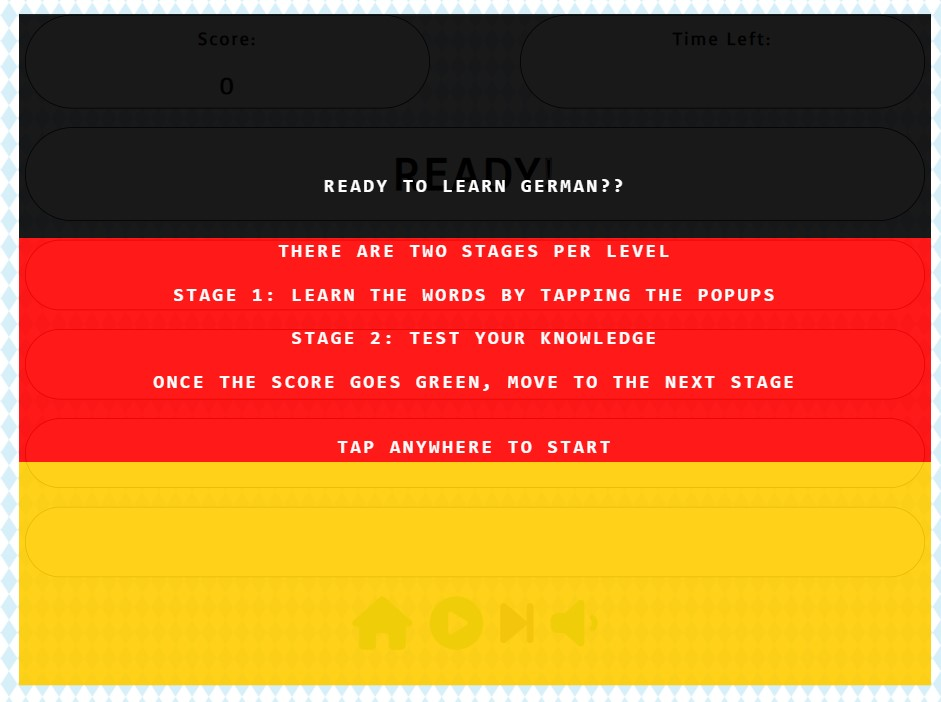
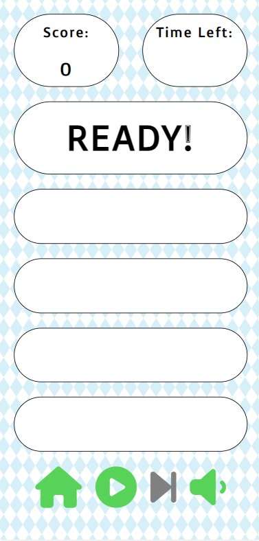
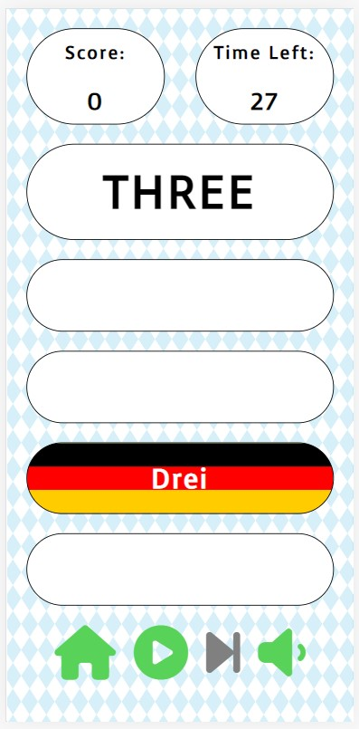
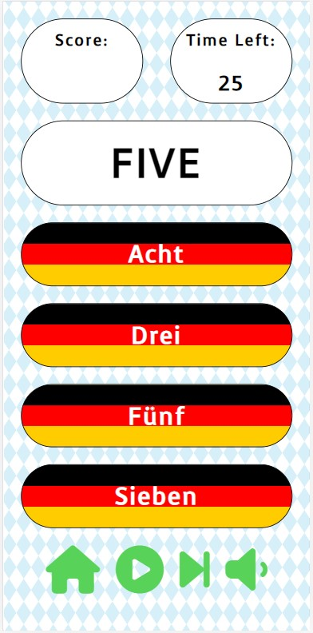

---

# [LEARN GERMAN](https://garymast.github.io/Language-Game/) - An interactive learning game, helping beginners learn the basics of German before a visit there

---

# CONTENTS

* [USER EXPERIENCE](#USEREXPERIENCE)
    * [Initial Discussion](#Initialdiscussion)
    * [User Stories](#Userstories)
* [Design](#Design)
	* [Colour Scheme](#Colourscheme)
	* [Typography](#Typography)
	* [Imagery](#Imagery)
	* [Wireframes](#Wireframes)
* [Features](#Features)

---

# USER EXPERIENCE

## Initial Discussion
I have a potential future work opportunity in Switzerland, and as such will need to learn the German language. A good excuse as any to create a German Learning game!

## User Stories
Based on the target audience and their needs, the following user stories were identified:

* The site should be targeted towards beginners
* The color scheme should be consistent with German themes
* The user should be able to hear the German pronunciations of words
* The user should be able to keep track of their score.

## Design
The overall design is simple. It has a very basic layout, allowing the user to concentrate on learning German. The site is targeted at mobile users, and as such the quality of the UI decreases as the screen size increases.

## Colour Scheme
A German theme was required, so I used a Bavarian blue and white pattern as a background. The German colours of Black, Red and Yellow are also used.

## Typography
I used a very simple font from Google Fonts - "Voces"

## Imagery
There is only a background image in this site. I did not want images distracting the user from their goal

## Wireframes
I used Microsoft Word to create a basic Wireframe, which didn't change much throughout the project.

## Features
1. Home/landing page

2. First Level Page

3. Stage 1 During Game

4. Stage 2 During Game

Whac a mole tutorial youtube tutorial
https://www.youtube.com/watch?v=rJU3tHLgb_c

bavaria background image <a href="https://www.freepik.com/free-vector/oktoberfest-blue-seamless-rhombus-background-vector-illustration_24450729.htm#query=bavaria%20pattern&position=0&from_view=keyword&track=ais">Image by svstudioart</a> on Freepik

Love Maths walkthrough

https://developer.mozilla.org/en-US/docs/Web/API/Web_Speech_API/Using_the_Web_Speech_API

https://dev.to/saikatbishal/how-to-make-a-splash-screen-using-html-css-and-javascript-240m