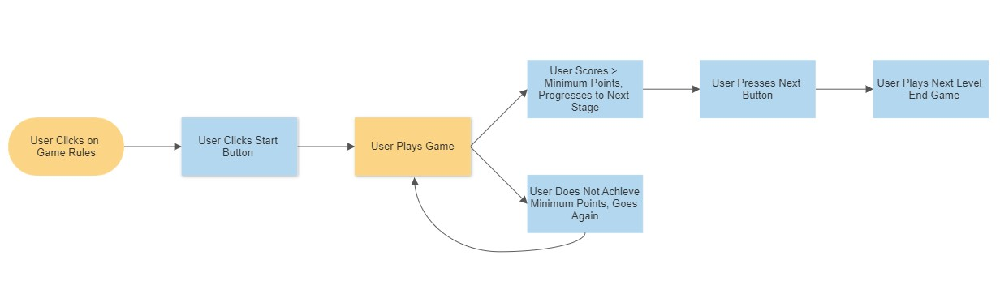

---

# [LEARN GERMAN](https://garymast.github.io/Language-Game/) - An interactive learning game, helping beginners learn the basics of German before a visit there

---

# CONTENTS

* [USER EXPERIENCE](#USEREXPERIENCE)
    * [Initial Discussion](#Initialdiscussion)
    * [User Stories](#Userstories)
* [Design](#Design)
	* [Colour Scheme](#Colourscheme)
	* [Typography](#Typography)
	* [Imagery](#Imagery)
	* [Wireframes](#Wireframes)
* [Features](#Features)
* [Technolgy used ](#Technologyused)
* [Testing](#Testing)
    * [Code validation ](#Codevalidation)
    * [Issues I ran into ](#Issuesiraninto)
    * [Lighthouse](#Lighthouse)
    * [Deployment](#Deployment)
* [Crediations and citataions](#Crediationsandcitataions)
    * [Images](#Images)
    * [Code used](#Codeused)
* [Acknowledgments](#Acknowledgments)

---

# USER EXPERIENCE

## Initial Discussion
I have a potential future work opportunity in Switzerland, and as such will need to learn the German language. A good excuse as any to create a German Learning game!

## User Stories
Based on the target audience and their needs, the following user stories were identified:

* The site should be targeted towards beginners
* The color scheme should be consistent with German themes
* The user should be able to hear the German pronunciations of words
* The user should be able to keep track of their score.

## Design
The overall design is simple. It has a very basic layout, allowing the user to concentrate on learning German. The site is targeted at mobile users, and as such the quality of the UI decreases as the screen size increases.

## Colour Scheme
A German theme was required, so I used a Bavarian blue and white pattern as a background. The German colours of Black, Red and Yellow are also used.

## Typography
I used a very simple font from Google Fonts - "Voces"

## Imagery
There is only a background image in this site. I did not want images distracting the user from their goal

## Wireframes
I used Microsoft Word to create a basic Wireframe, which didn't change much throughout the project.

## Features
1. Home/landing page

2. First Level Page

3. Stage 1 During Game

4. Stage 2 During Game

# Technology Used
This project primarily relies on JavaScript (JS) to build a dynamic and interactive web application. While HTML and CSS are still utilized, the main focus and driving force behind this project is the extensive use of JavaScript. Here's an overview of how these technologies are employed:

## JavaScript (JS)
JavaScript is a powerful programming language that enables the creation of interactive and dynamic web applications. In this project, JS takes center stage and serves as the primary technology used for development. It allows you to handle user interactions, manipulate HTML elements, perform calculations, make HTTP requests, and dynamically update the content of the web page. JS plays a vital role in enhancing the user experience and adding functionality to the application.

## HTML (Hypertext Markup Language)
HTML is the standard markup language used for structuring the content of web pages. While the focus of this project is on JavaScript, HTML is still necessary to create the basic structure and layout of the web application. It defines the various elements such as headings, paragraphs, links, images, and forms that make up the user interface. HTML provides the foundation for organizing and presenting the content in a logical and hierarchical manner.

## CSS (Cascading Style Sheets)
CSS is a stylesheet language that is responsible for the presentation and styling of web pages. In this project, CSS is used to enhance the visual design and aesthetics of the web application. While the main emphasis lies on JavaScript, CSS still plays a significant role in customizing the appearance of the HTML elements. By applying CSS styles, you can create a visually appealing and consistent user interface.

While HTML and CSS are utilized in this project, the primary focus is on JavaScript. JavaScript enables the creation of a dynamic and interactive web application, allowing for enhanced user experiences and added functionality. By leveraging the power of JavaScript, you can build robust web applications that meet diverse requirements and cater to user needs.

# Testing
| User interaction | Does the function work as intended? (Yes/No) | Why? |
|:---:|:---:|---|
| User clicks anywhere to remove splash screen  | Yes | |
| User clicks the play button to start a game | Yes | |
| The home button returns to the splash screen | Yes | |
| The volume icon turns the volume on? off | Yes | |
| Countdown timer tracks remaining time | Yes | |
| The score is kept updated | Yes | |
| The next button takes the user to the next stage | Yes | |
| Final score is shown with correct message | Yes | |
| Selections turn green where correct | Yes | |

# js logic flow chart 

## Code Validation

I used JSHint to check and validate my code throughout the project:

Whac a mole tutorial youtube tutorial
https://www.youtube.com/watch?v=rJU3tHLgb_c

bavaria background image <a href="https://www.freepik.com/free-vector/oktoberfest-blue-seamless-rhombus-background-vector-illustration_24450729.htm#query=bavaria%20pattern&position=0&from_view=keyword&track=ais">Image by svstudioart</a> on Freepik

Love Maths walkthrough

https://developer.mozilla.org/en-US/docs/Web/API/Web_Speech_API/Using_the_Web_Speech_API

https://dev.to/saikatbishal/how-to-make-a-splash-screen-using-html-css-and-javascript-240m